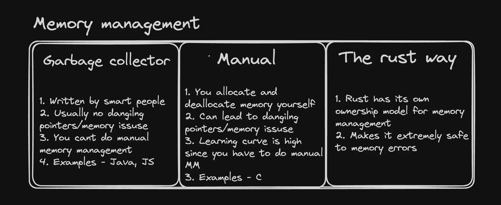

# RUST

## VARIABLES IN RUST

### Integer Types:
- **Signed integers:**  
  `i8`, `i16`, `i32`, `i64`, `i128` (default: `i32`)
- **Unsigned integers:**  
  `u8`, `u16`, `u32`, `u64`, `u128`
- **Floating-point numbers:**  
  `f32`, `f64`

#### Example:
```rust
let x: i8 = -23;
let y: u32 = 499;
let z: f32 = 299.829;

print!("x: {}\ny: {}\nz: {}\n", x, y, z);
```

**Note:**  
- **Signed integers** allow both positive and negative values, while **unsigned integers** allow only non-negative values.
- **Floating-point numbers** are used for values with decimals.  
- Integers and floating-point values are efficiently managed in memory for performance.

---

### Mutability and Loops:
By default, Rust variables are **immutable**. Use `mut` to declare mutable variables.

#### Example:
```rust
let mut a: i32 = 9;

for i in 0..100 {
    a += i;
}

print!("Value of 'a' after increment: {}\n", a);
```

**Note:**  
- This example shows a `for` loop iterating over a range from `0` to `99` (exclusive). 
- The variable `a` is mutable, so its value changes during the loop execution.

---

### Boolean:
- **Type:** `bool`  
  Booleans store `true` or `false` values and are often used for conditional logic.

#### Example:
```rust
let is_male: bool = true;
let is_above_18: bool = true;

if is_male {
    print!("YOU ARE A MALE\n");
} else {
    print!("YOU ARE A FEMALE");
}

if is_male && is_above_18 {
    print!("YOU ARE A LEGAL MALE\n");
}
```

**Note:**  
- Booleans are used in `if` conditions to control program flow.
- Logical operators like `&&` (AND) and `||` (OR) are used for compound conditions.

---

### Strings:
Rust strings are more complex than in other languages. Strings are stored as **heap-allocated** objects and are not indexed directly for safety.

#### Example:
```rust
let greeting: String = String::from("Hello world!");
print!("{}\n", greeting);

// Access a character safely using pattern matching
let char1 = greeting.chars().nth(2);
match char1 {
    Some(c) => println!("Char at index 2 is: {}", c),
    None => println!("NOTHING AT INDEX 2"),
}
```

**Note:**  
- **`chars().nth(index)`** returns an `Option<char>` to safely handle character access. 
- **Pattern matching** with `Some` and `None` ensures safe access without panics.

---

### Handling Optional Values:
Rust uses the `Option` type to handle values that may or may not exist.

#### Example:
```rust
let char1 = greeting.chars().nth(2);
match char1 {
    Some(c) => println!("Char at index 2 is: {}", c),
    None => println!("NOTHING AT INDEX 2"),
}
println!("{}", char1.unwrap()); // Unsafe, can panic if `None`
```

**Note:**  
- **`unwrap()`** retrieves the value if present but will panic if the value is `None`. It’s safer to use **pattern matching**.

---

### Functions with Return Types:
Functions in Rust can return values of any type. 

#### Example:
```rust
fn first_word(sentence: String) -> String {
    let mut ans = String::new();
    for char in sentence.chars() {
        ans.push_str(char.to_string().as_str());
        if char == ' ' {
            break;
        }
    }
    ans
}
```

**Explanation:**  
- The `first_word` function returns the first word from a sentence by iterating over its characters until it encounters a space.

---

### Loop with Ignored Variables:
The `_` is used to ignore variables in loops when you don’t need them, preventing warnings.

#### Example:
```rust
let n: i32 = 200;
for _ in 0..n {
    print!("Hello, World! ");
}


```
### Memory Management in  Rust:
- In rust if make any mistake while writing code for memory management(like dangling pointers/memory issue), the code won't compile



Whenever a program is written in any language, it `allocates` and `deallocates` the memory on the ram.

#### Example:
- This is a JS code.
```javascript
function main() {
  runLoop();
}

function runLoop() {
  let x = [];
  for (let i = 0; i < 100000; i++) {
    x.push(1);
  }
  console.log(x);
}

main();
```

as the runLoop function runs a new array `x` is created in the memory(Ram) and when the function gets completed the `gargbage collected`.

Memory management in Rust is one the most significant aspect of Rust, it is designed to ensure safety and efficiency without the need of any `garbage collector`.
- Not having a `garbage collector` make Rust fast.
