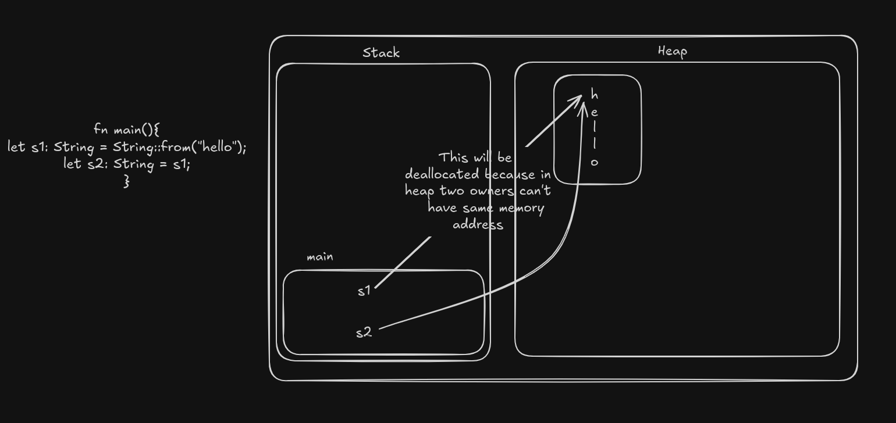
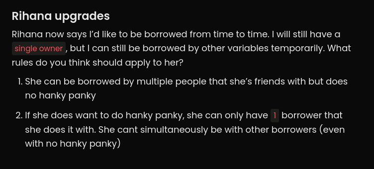
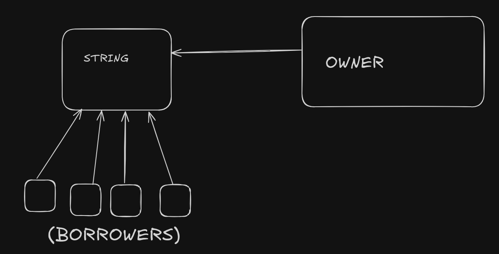
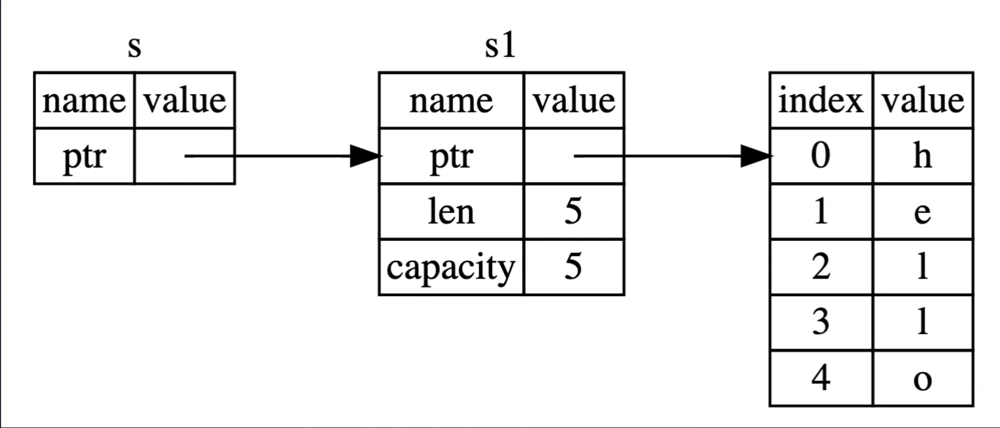
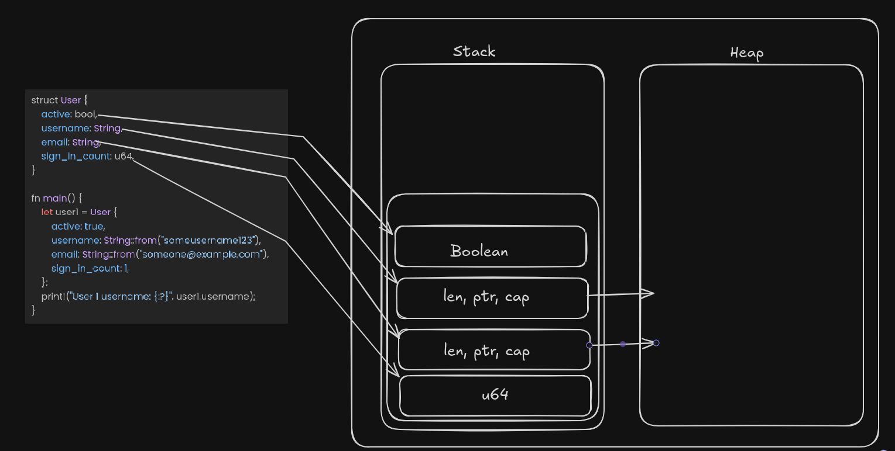

# RUST

## VARIABLES IN RUST

### Integer Types:
- **Signed integers:**  
  `i8`, `i16`, `i32`, `i64`, `i128` (default: `i32`)
- **Unsigned integers:**  
  `u8`, `u16`, `u32`, `u64`, `u128`
- **Floating-point numbers:**  
  `f32`, `f64`

#### Example:
```rust
let x: i8 = -23;
let y: u32 = 499;
let z: f32 = 299.829;

print!("x: {}\ny: {}\nz: {}\n", x, y, z);
```

**Note:**  
- **Signed integers** allow both positive and negative values, while **unsigned integers** allow only non-negative values.
- **Floating-point numbers** are used for values with decimals.  
- Integers and floating-point values are efficiently managed in memory for performance.

---

### Mutability and Loops:
By default, Rust variables are **immutable**. Use `mut` to declare mutable variables.

#### Example:
```rust
let mut a: i32 = 9;

for i in 0..100 {
    a += i;
}

print!("Value of 'a' after increment: {}\n", a);
```

**Note:**  
- This example shows a `for` loop iterating over a range from `0` to `99` (exclusive). 
- The variable `a` is mutable, so its value changes during the loop execution.

---

### Boolean:
- **Type:** `bool`  
  Booleans store `true` or `false` values and are often used for conditional logic.

#### Example:
```rust
let is_male: bool = true;
let is_above_18: bool = true;

if is_male {
    print!("YOU ARE A MALE\n");
} else {
    print!("YOU ARE A FEMALE");
}

if is_male && is_above_18 {
    print!("YOU ARE A LEGAL MALE\n");
}
```

**Note:**  
- Booleans are used in `if` conditions to control program flow.
- Logical operators like `&&` (AND) and `||` (OR) are used for compound conditions.

---

### Strings:
Rust strings are more complex than in other languages. Strings are stored as **heap-allocated** objects and are not indexed directly for safety.

#### Example:
```rust
let greeting: String = String::from("Hello world!");
print!("{}\n", greeting);

// Access a character safely using pattern matching
let char1 = greeting.chars().nth(2);
match char1 {
    Some(c) => println!("Char at index 2 is: {}", c),
    None => println!("NOTHING AT INDEX 2"),
}
```

**Note:**  
- **`chars().nth(index)`** returns an `Option<char>` to safely handle character access. 
- **Pattern matching** with `Some` and `None` ensures safe access without panics.

---

## Handling Optional Values:
Rust uses the `Option` type to handle values that may or may not exist.

#### Example:
```rust
let char1 = greeting.chars().nth(2);
match char1 {
    Some(c) => println!("Char at index 2 is: {}", c),
    None => println!("NOTHING AT INDEX 2"),
}
println!("{}", char1.unwrap()); // Unsafe, can panic if `None`
```

**Note:**  
- **`unwrap()`** retrieves the value if present but will panic if the value is `None`. It’s safer to use **pattern matching**.

---

## Functions with Return Types:
Functions in Rust can return values of any type. 

#### Example:
```rust
fn first_word(sentence: String) -> String {
    let mut ans = String::new();
    for char in sentence.chars() {
        ans.push_str(char.to_string().as_str());
        if char == ' ' {
            break;
        }
    }
    ans
}
```

**Explanation:**  
- The `first_word` function returns the first word from a sentence by iterating over its characters until it encounters a space.

---

### Loop with Ignored Variables:
The `_` is used to ignore variables in loops when you don’t need them, preventing warnings.

#### Example:
```rust
let n: i32 = 200;
for _ in 0..n {
    print!("Hello, World! ");
}


```
## Memory Management in  Rust:
- In rust if make any mistake while writing code for memory management(like dangling pointers/memory issue), the code won't compile


Whenever a program is written in any language, it `allocates` and `deallocates` the memory on the ram.

#### Example:
- This is a JS code.
```javascript
function main() {
  runLoop();
}

function runLoop() {
  let x = [];
  for (let i = 0; i < 100000; i++) {
    x.push(1);
  }
  console.log(x);
}

main();
```

as the runLoop function runs a new array `x` is created in the memory(Ram) and when the function gets completed the `gargbage collected`.

Memory management in Rust is one the most significant aspect of Rust, it is designed to ensure safety and efficiency without the need of any `garbage collector`.
- Not having a `garbage collector` make Rust fast.

## Mutability
Variables whose values can't be changed after assigning are called `immutable`, whereas the value of a `mutable` variable can be changed.

By default variables are `immutable` in rust because 
  - Knowing that a certain data will not change will allow the compiler to optimize better code.
  - Immutable data is inherently thread-safe because if no thread can alter the data, then no synchronization is needed when the data is accessed concurrently.
  

```rust
fn main(){
  let x = 10;
  
  for i in 0..100{
    x+=i;
  }
  print("{}", x);
}
```

- This will give error as `x` is `immutable`

```rust
fn main(){
  let mut x = 10;
  for i in 0..10{
    x+=i;
  }
  print!("{}", x);
}
```

- This will work totally fine

```
💡 Concept of Mutability and Immutability is not as same as it is in JS for const.
While using const one can update the values of an array or an object.
```

## Stack VS Heap

- Stack: Fast allocation and deallocation. Rust uses Stack memory for most primitive data types and for data whose size is known at the runtime (eg: numbers, boolean).
- Heap: Used for data that can grow on runtime (eg: vectors, strings);


## Ownership
Every piece of data in Rust has a single owner and when that owner goes out of scope Rust automatically deallocates the memory provided to that piece of data. It helps in
preventing `Memory Leaks`;

### What is Ownership?
Ownership is a set of rules that governs how a Rust program manages memory. In Rust memory is managed through a system of ownership with a set of rules that a compiler checks. If any of the rules are violated the program won't even compile. The features of Ownership won't slow down your program while it's running.

### Ownership Rules
- Each value in Rust has a `owner`.
- There can only be one `owner` at a time.
- When the `owner` goes out of scope, the value will be dropped.

#### Stack Variables
Ownership is more relevant in Heap Variables, because in Stack Variables primitive data types pass on a copy, rather than moving the variables.

#### Heap Variables
Heap variables always want to have a `single` owner, and if their owner goes out of the scope, the get `deallocated`.

```rust
let s1: String = String::from("hello");
let s2: String = s1;
print!("{}", s1) //This will generate error because the ownership has been moved from s1 to s2;
```


###### Whenever confused look for Harkirat's Girlfriend example.


- Whenever the current owner of the data dies the memory gets cleared up.

- This help s in preventing problems like `Dangling pointer` and `Double free errors`.

This makes `Rust` extremely memory safe

#### In Short: 
- Anything on the heap will have an owner and it will always have a single owner at a given point of time.

### Cloning a String
We use `.clone()` to clone a variable. So while using `.clone()` we are not letting the other party take over the ownership of the variable, instead we are just making a variable that is the clone of the first one and the other party will point to it.

```rust
fn main(){
  let s1: String = String::from("hello world");
  take_ownership(s1.clone());
  print!("{}", s1) // This would have given error if we have not used clone
}

fn take_ownership(new_str){
  print!("{}", new_str);
}
```

## Borrowing And References



### Borrowing 
Borrowing means allowing different functions to have the access to the variable without passing the ownership of that variable.

You can transfer ownership of variables to functions and. By passing a reference of the string to the function. While the ownership of the variable remains with the original variable.

- The main feature of borrowing is that is the borrower dies then the variable will not die.

```rust
fn main(){
  let s1: String = String::from("This is a new string");
  borrowing(&s1);
  println!("{}", s1);
}

fn borrowing(my_str: &String){
  println!("{}", my_str);
}
```

- The `ownership` of string `s1` will not be passed to the borrowing function, because we have passed the string `s1` by `reference`. 




### References
References means giving the address of a string rather than giving the ownership of the string to the other function
```rust
fn main(){
  let s1: String = String::from("hello");
  let s2 = &s1;
  println!("{}", s2); 
  println!("{}", s1); // This will totally work fine because we gave the address of s1 to s2 not the ownership

}
```
 


### Mutable Reference
What is you want to `update` the value of the variable.

```rust
fn main(){
  let mut s1: String = String::from("Hello ");
  update_word(&mut s1);
  print!("{}", s1);
}

fn update_word(s: &mut String){
  s.push_str(" World");
}
```

The function `update_word` will borrow the string `s1` with a `mutable reference` and can update the string. It will work fine.

```rust
fn main(){
  let mut s1: String = String::from("Hello ");
  let s2: &mut String = &mut s1;
  update_word(&mut s1);
  print!("{}", s1);
  print!("{}", s2);
}

fn update_word(s: &mut String){
  s.push_str(" World");
}
```

This will give `error` because string `s2` has already `borrowed` `s1` with a `mutable reference` and until it is finished `s1` can't be passed to `update_word` function with a `mutable reference`.

Note:
- We can have a `single mutable reference` at a given point of time and no other `borrowers` also even as `immutable`.

Rules for Borrowing
- There can be many `immutable references` at the same time.
- There can be only one `mutable reference` at a given time.
- If there is a `mutable reference` you can not have another `immutable reference` either.

## Structs
Structs lets you structure the data together. Similar to `objects` in javascript.

```rust
struct User{
  name: String,
  age: i32,
  is_active: bool
}

fn main(){
  let user = User{
    name: String::from("Sameer"),
    age: 20,
    is_active: false
  };
  println!("{} is {} years old", user.name, user.age);
}

```

> while implementing `structs` `self` is same as `this` is OOPs


### Data Storage of Structs in Stack And Heap


## Enums

Enums in rust are similar to Enums in typescript.

```rust
enum Direction{
  North, 
  East,
  West,
  South
}

fn main(){
  let my_direction:Direction = Direction::North;
  move_around(my_direction);
}

fn move_around(direction: Direction){
  // Write some logic 
}
```

### Why Enums?
Enums allow you to define types with multiple possible variants, enabling safer and more expressive code.

### Enums with Values
```rust
enum Shape{
  Circle(f64),
  Square(f64),
  Rectangle(f64, f64)
}

fn main(){
  let circle: Shape = Shape::Circle(12.0);
  let square: Shape = Shape::Square(10.0);
  let rectangle: Shape = Shape::Rectangle(10.23, 20.6);

  calculate_area(circle);
}

fn calculate_area(shape: Shape)->f64{
  // Logic to calculate area of the defined shape
}
```

### Pattern Matching in Enums

```rust
fn calculate_area(shape: Shape)->f64{
  match shape{
    Shape::Circle(radius) => std::f64::consts::PI*radius*radius,
    Shape::Square(side_len) => side_len*side_len,
    Shape::Rectangle(height, width) => height*width
  }
}
```

## Error Handling
Different languages have different ways to handle error. For ex. javascript uses `try catch` block to handle errors. But rust has a different approach to handle errors.

- try catch block in JS

```javascript
try{
  const data = fs.readFileSync("example.txt", "utf8");
  console.log(data);
}
catch(error){
  console.log(`Error reading file: ${error}`);
}
```

We used `try catch` block here because reading a file is unpredictable, because there are chances that the file does not exist.


- In Rust
```rust
let res = fs::read_to_string("example.txt");
match res{
  Ok(content) => println!("Contents of the file are: {}", content),
  Err(err) => println!("Error reading file: {}", err)
}
```

## Option Enum

The concept of `Option Enum` was introduced in rust to handle the concept of `nullability` in a safe and expressive way.

- Example

```rust
fn main(){
  let str: String = String::from("Sameer");
  let res = find_first_a(str);
  match res{
    Some(index)=>println!("First 'a' is present at index: {}", index),
    None => println!("'a' os not present in the given string")
  }

  let res2 = find_first_a_result(str);
  match res{
    Ok(index) => println!("'a' is present at index: {}", index),
    Err(error) => println!("{}", error)
  }
}

fn find_first_a(str: String) -> Option<i32>{
  for (index, char) in str.chars().enumerate(){
    if(char=='a'){
      return Some(index as i32);
    }
  }
  return None;
}

// We can use 'result' also instead of Option

fn find_first_a_result(str: String) -> Result<i32, String>{
  for(index, char) in str.chars().enumerate(){
    if(char=='a'){
      return Ok(index as i32);
    }
  }
  return Err("'a' is not present".to_string);
}
```

## Cargo, Packages, and External Deps
Just like nodejs has `npm`, the rust ecosystem has `cargo`.

Cargo is a `package manager` in rust, which means we can use it to bring packages(crates in case of rust) to our project.

- You can add external `crates` into your code using `cargo add crate_name`.
- Crates are like `npm packages`

## Vectors in RUST

```rust
fn main(){
  let mut vec1 = Vec::new();
  vec1.push(1);
  vec1.push(2);
  vec1.push(3);

  println!("{}", vec1);
}
```
You can simply write `vector_name.remove(index)` to remove a value at a particular index.

> Initializing a Vector using macros in Rust

```rust
fn main(){
  let numbers = vec![1,2,3,4];
  for num in numbers{
    print!("{}", num);
  }
}
```
